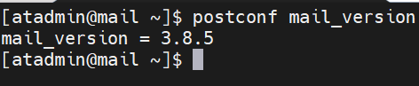

# Installing Postfix

## Configuring hostname

1.  If the hostname is not configured yet to have your mail server FQDN you can set it using the command below:

    `sudo hostnamectl set-hostname <fqdn>`&#x20;
2. Reboot the machine using `sudo reboot -f`&#x20;

## Configure DNS Records

1. On our own authoritative DNS server **ns1.aidentrix.lan** we will add our **MX**, **A** and **PTR** record
2.  Add the following records for the forward lookup zone using `doas nano /var/bind/aidentrix.lan/db.forward`


    **A Record:**

    `mail IN A 172.16.16.20`&#x20;

    **MX Record:**

    `@ IN MX 10 mail.aidentrix.lan.`&#x20;


    **Result:**

    <figure><figcaption></figcaption></figure>
3.  Configuring the PTR record for our reverse lookup `doas nano /var/bind/aidentrix.lan/db.reverse`&#x20;


    **PTR Record:**

    `20 IN PTR mail.aidentrix.lan.`&#x20;


    **Result:**

    <figure><figcaption></figcaption></figure>
4. Restart the bind service using `doas rc-service named restart` on both our recursive DNS server and authoritative DNS server
5.  Test the DNS record using the following commands from the mail server

    `nslookup mail.aidentrix.lan` and `nslookup 172.16.16.20`

```bash
[atadmin@mail ~]$ nslookup mail.aidentrix.lan
Server:         172.16.16.16
Address:        172.16.16.16#53

Non-authoritative answer:
Name:   mail.aidentrix.lan
Address: 172.16.16.20

[atadmin@mail ~]$ nslookup 172.16.16.20
20.16.16.172.in-addr.arpa       name = mail.aidentrix.lan.

Authoritative answers can be found from:

[atadmin@mail ~]$
```

## Installing Postfix

1.  Perform a repository package update using the command below:

    `sudo dnf update & sudo dnf upgrade -y`&#x20;
2. Install postfix using this command `sudo dnf install postfix -y`  on our case it should be installed with our installation of CentOS
3.  Check the version of postfix using `postconf mail_version`

    <div align="left"><figure><figcaption></figcaption></figure></div>

