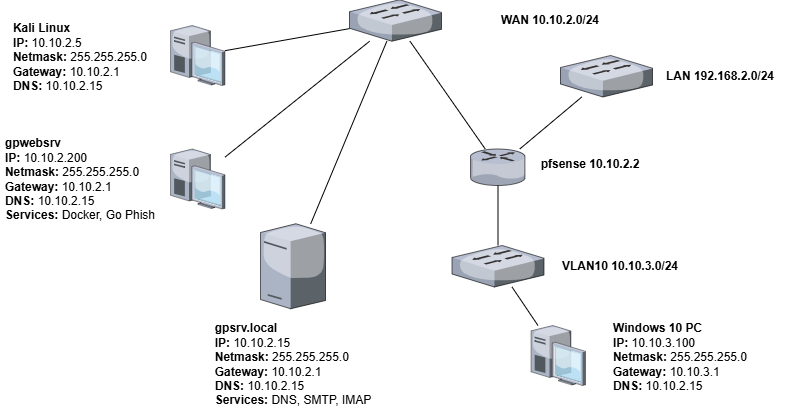
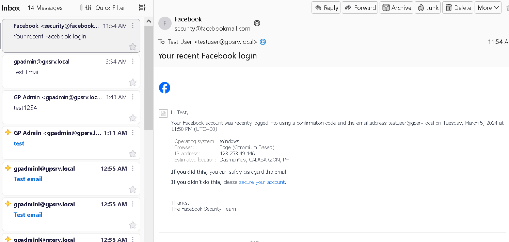
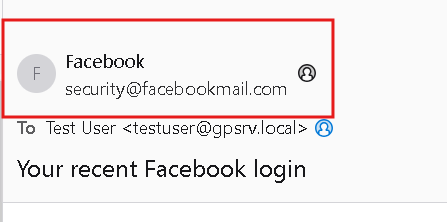

# Go Phish: Ethical Phishing Campaigns for Awareness

During my hands-on task for the Cybercrime Security Course, I faced difficulties in crafting a convincing ethical spoofing email to educate clients or employees. The goal was to create an email that would encourage recipients to click without raising suspicion about the sender's address. Initially, I attempted using ZPhisher along with free trial SMTP server services, but my accounts were frequently blocked.

After conducting further research, I discovered that Go Phish could be a viable alternative, especially when paired with a Virtual Private Server (VPS) for Go Phish and Mail Server. For this demonstration, I set up my own DNS Server, Mail Server, and Go Phish Web Server to simulate a public network, along with a device operating behind a private network. All of these virtual machines were created inside Hyper-V

Hey there! 📡 Just a quick heads-up: I'm not a Network Engineer, so my diagram might not be top-notch. Also, I threw this together in a bit of a rush, so most instructions link to documentation or other helpful links. 🚀

### Infrastructure Overview

<figure><figcaption><p>My WAN Network acting as Public WWW</p></figcaption></figure>

### DNS Server and SMTP Server Configuration

You can follow the articles below on how to setup you local DNS, SMTP and IMAP server

DNS Server: [https://totatca.com/ttc-143/](https://totatca.com/ttc-143/)

SMTP Server: [https://www.linuxbabe.com/mail-server/setup-basic-postfix-mail-sever-ubuntu](https://www.linuxbabe.com/mail-server/setup-basic-postfix-mail-sever-ubuntu)

IMAP Server: [https://www.linuxbabe.com/mail-server/secure-email-server-ubuntu-postfix-dovecot](https://www.linuxbabe.com/mail-server/secure-email-server-ubuntu-postfix-dovecot)


### Configuring Go Phish on gpwebsrv

1. Install Docker Engine using this [article](https://docs.docker.com/engine/install/ubuntu/)
2. Docker pull the Go Phish image from [here ](https://hub.docker.com/r/gophish/gophish/)
3.  For persistence we will create our config.json for Go Phish container. Change directory to **/opt** and make a directory with a name of  **gophish**

    <div align="left"><figure><figcaption></figcaption></figure></div>
4.  Create a **config.json** file, use the `touch` command. Then open it with your preferred text editor and insert the following configuration

    ```json
    {
      "admin_server": {
        "listen_url": "0.0.0.0:3333",
        "use_tls": true,
        "cert_path": "gophish_admin.crt",
        "key_path": "gophish_admin.key",
        "trusted_origins": []
      },
      "phish_server": {
        "listen_url": "0.0.0.0:80",
        "use_tls": false,
        "cert_path": "example.crt",
        "key_path": "example.key"
      },
      "db_name": "sqlite3",
      "db_path": "gophish.db",
      "migrations_prefix": "db/db_",
      "contact_address": "",
      "logging": {
        "filename": "",
        "level": ""
      }
    }
    ```
5.  Create the docker using the command below

    ```bash
    sudo docker run -dit --user root --name gpwebsrv --restart=always \
    -p 10.10.2.200:3333:3333 -p 10.10.2.200:80:80 \
    -v /opt/gophish/config.json:/opt/gophish/config.json \
    gophish/gophish
    ```
6.  Confirm that the server is listening on port :3333 and :80

    ```shell
    gpadmin@gpwebsrv:/opt/gophish$ sudo ss -tlpn | grep :3333
    [sudo] password for gpadmin: 
    LISTEN     0      4096          10.10.2.200:3333         0.0.0.0:*       users:(("docker-proxy",pid=12128,fd=4))

    gpadmin@gpwebsrv:/opt/gophish$ sudo ss -tlpn | grep :80
    LISTEN     0      4096          10.10.2.200:80           0.0.0.0:*       users:(("docker-proxy",pid=12121,fd=4))

    gpadmin@gpwebsrv:/opt/gophish$
    ```
7.  Get the password of the GoPhish admin portal using the sudo docker logs gpwebsrv

    <figure><figcaption></figcaption></figure>
8. Access the application by navigating to `http://<IP of your VM>:3333`. Use the credentials obtained from the `sudo docker logs`. You will be prompted to change your password to one of your choosing.
9.  First, make sure your Sending Profile matches the SMTP server settings you set up earlier

    <div align="left"><figure><figcaption></figcaption></figure></div>


10. Perform a test email and if your SMTP server is configured correctly it should return a success status.

    <div align="left"><figure><figcaption></figcaption></figure></div>
11. You can confirm this by checking the Mozilla Thunderbird Client on the Windows 10 PC

    <figure><figcaption></figcaption></figure>
12. Go to User and Groups, create the group users who will receive the phishing emails.

    <div align="left"><figure><figcaption></figcaption></figure></div>


13. Go to Landing Page and craft the page that a user will see when they clicked the link.


&#x20;      Note: Sometimes Go Phish cannot capture the credentials when a website is imported

&#x20;      because of the following:


&#x20;      **Form Action**: The form action should have a `submit` attribute

&#x20;      **Method**: Ensure that the form method is set to `POST`.

&#x20;      **Input Field Name**: Ensure that the input field names are set to `username` and `password`.

<figure><figcaption></figcaption></figure>

&#x20;     In my case I created my custom HTML for this demo:

<figure><figcaption></figcaption></figure>

9.  Go to **Email templates** and craft your phishing email. I used import Email to create my template.

    <div align="left"><figure><figcaption></figcaption></figure></div>

    <figure><figcaption></figcaption></figure>

    Note: Don't forget to set the appropriate variable on the email template so that we don't need to create a template for each user. More information can be found [here](https://docs.getgophish.com/user-guide/documentation/templates)&#x20;


10. Go to **Campaigns** and start your phishing campaigns.

    <div align="left"><figure><figcaption></figcaption></figure></div>


### Target's perspective

The phishing email we crafted successfully reached the target's machine.

<figure><figcaption></figcaption></figure>

The original email was sent from **gpadmin@gpsrv.local**. However, by utilizing the GoPhish Envelope Sender, it is expertly modified to mimic an authentic Facebook Security Email, minus the image and the badge


**Spoofed Email from the Target User's Mozilla Thunderbird Client**

<div align="left"><figure><figcaption></figcaption></figure></div>

**Real sample email from Facebook from GMail:**

<div align="left"><figure><figcaption></figcaption></figure></div>

Upon clicking the **Secure Your Account** link, the user will be directed to a simulated Facebook login page. After entering their credentials, they will be automatically redirected to the destination specified within the Landing Page settings in GoPhish.

<figure><figcaption></figcaption></figure>

We go back and check Go Phish and look for the information gathered from the user.


### Checking Go Phish Campaign

1. Go to Campaign and select the View Results button 
2.  We can check that somebody opened the email, click the malicious URL and submitted data on our fake Facebook website

    <div align="left"><figure><figcaption></figcaption></figure></div>
3.  Identifying the user who fell for the phishing email.

    <figure><figcaption></figcaption></figure>
4.  Details captured from the user

    <figure><figcaption></figcaption></figure>

That's it. This my take on the Social Engineering hands on for my Cyber Crime Security Course.
